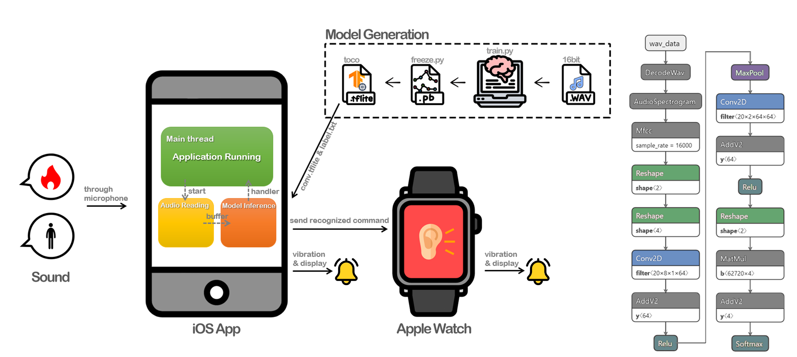

## Watch Out: 청각장애인을 위한 음성 기반 위험 인식 어플

화재나 교통사고 발생시 위험 상황을 소리로 인지하지 못해 피해를 입는 청각장애인들이 많습니다. 문제는 화재와 같은 상황이 발생했을때 청각장애인의 빠른 대피를 위한 소방훈련 등이 실시되고 있지만, 이들이 소리를 듣지 못하는 탓에 사태 발생 시 실질적으로 도움이 되기는 어렵다는 것입니다. 비단 청각장애인 뿐만 아니라, 노이즈 캔슬링 등 외부 소음을 차단하는 이어폰들의 성능이 향상되면서 일반인들도 주변의 위험 상황을 인지하지 못해 사고를 당하는 사례가 빈번히 발생하고 있습니다.

이에 대한 기존의 해결책으로는 주변의 소리를 인식 및 분류하여 위험 상황일 경우 알림을 주는 스마트폰 어플리케이션 등이 있지만, 1. 사이렌 소리 등 단순한 소리는 인식할 수는 있지만 "불이야" 등 위험 상황에 대한 키워드가 담긴 메세지는 인식할 수 없고 2. 워치 등 소리를 더 명확하게 인식하고 사용자에게 직접적인 알림을 줄 수 있는 웨어러블 기기에 접목된 사례 또한 거의 없습니다. watch-out 프로젝트는 키워드를 인식하여 알림을 줄 수 있는 스마트 워치 어플리케이션입니다.

즉, Watch Out 은 Tensorflow Lite 모델을 이용해 인터넷에 접속이 안되는 상황에서도 작동할 수 있는 아이폰 & 애플워치 어플리케이션입니다. 인식할 수 있는 키워드로는 2020년 9월 기준 "불이야" 와 "수지"가 있습니다. 

- **"불이야"** - 청각장애인들이 화재상황에서 "불이야!"라는 소리를 듣지 못하여 대처가 늦거나 위험에 빠질 수도 있다는 기사 내용을 바탕으로 키워드를 선정하였습니다.
- **"수지"** -  자신의 이름을 부르는 것을 듣지 못한다는 것 또한 불편한 점이 될 수도 있다는 생각을 바탕으로 watch-out이 대신 사용자의 이름을 듣도록 하였습니다. 발음하기 쉽고 다른 이름과 헷갈리지 않는 대표적인 이름으로 '수지'를 선택하였습니다.

### 텐서플로우 라이트 모델 훈련

- **모델 학습으로** [바로가기](https://colab.research.google.com/github/sanghunkang/tensorflow-lite/blob/master/mobile_team_project/model_training/train_speech_model_ios_ko.ipynb)
- **데이터 준비 및 형식**

    저희가 참고한 speech_commands 예제 모델에 들어있던 데이터를 바탕으로 데이터의 형식과 데이터의 개수를 정하였습니다.  데이터 개수는 한 키워드당 2000개, 데이터 형식은 1초 미만의 wav 파일을 준비하였습니다. 모델이 오버피팅이 되지 않도록 최대한 다양한 사람의 목소리, 다양한 어조와 톤, 빠르기로 녹음을 진행 하였습니다.

- **트레이닝 방식 및 커맨드**
    - 훈련

        train.py를 실행시킬 때 플래그값들을 조절해서 모델을 커스텀화 할 수 있습니다. 여기서 중요한 부분은 다음과 같습니다.

        1. `—model_architecture` 어떤 네트워크를 사용할 것인지 지정하는 플래그. CNN을 기반으로한 여러 변형형태 중 하나를 선택할 수 있다. 본 프로젝트에서는 iOS 예제에서 사용하고 있는 모델인 "conv"모델을 사용하였습니다.
        2. `—wanted_words` 스크립트 상에서 이 인자를 사용해서 우리가 인식하고자 하는 단어를 정의할 수 있습니다. 저희는 bulyiya, suzy를 설정했습니다.
        3. `—data_dir` 훈련에 사용할 데이터가 저장되어 있는 디렉토리. —wanted_words에서 인식하고자 한 단어들은 —data_dir에서 지정한 경로 안에 같은 이름으로 된 디렉토리를 만들고 그 안에 훈련에 사용할 파일들을 저장해야 합니다. 훈련데이터는 16bit-wav의 형식을 따라야 합니다.
        4. `—train_dir` 훈련결과를 저장할 디렉토리. checkpoint 파일이 여기서 지정한 경로에 저장됩니다. 
        5. `—how_many_training_steps` epoch. 데이터를 몇 바퀴 돌려서 학습할 것인지 설정합니다.
    - freeze

        interpreter 생성에 필요한 .pb파일을 생성합니다.

    - interpreter compile

        .pb파일을 .tflite파일로 변환합니다. 입출력에 사용하는 array를 지정할 때 주의해야 합니다.

    - inference

        iOS 앱과 연동하기에 앞서 훈련한 모델의 인식 성능을 python 스크립트를 사용하여 확인할 수 있습니다.

        1. pb: .pb를 로드하면 "tensorflow 그래프를 거쳐서 inference합니다. tensorflow 그래프는 훈련 단계에서 데이터가 흐르는 방식과 동일한 입출력구조를 갖습니다. 데이터 입력시 네트워크의 각 노드에서의 동작을 확인하고자 할 때 유리합니다.
        2. tflite: .tflite를 로드하면 컴파일된 interpreter를 거쳐서 inference합니다. 실제 어플 또는 장비에 배포했을 때 데이터가 흐르는 방식과 동일한 입출력구조를 갖습니다. 실제 목표로 하는 구동환경에서의 연동성을 확인하고자 할 때 유리합니다. 
- **Issue 및 해결**
    - Issue 1: **텐서플로우 버전 이슈**

        2.x version부터는 tflite_converter에서 saved_model의 변환만을 지원하기 때문에 기존 모델 생성에서 문제가 발생하였습니다.

        저희가 참고한 speech_commands 예제는 1.x tensorflow에 맞춰서 개발되었습니다. 따라서 speech_commands 예제에서 사용하는 모델 훈련결과 저장방식은 checkpoint입니다. 

        현재(2020.09) tensorflow 설치시 특별한 설정을 하지 않으면 2.x version tensorflow가 설치됩니다. 따라서 교재에서 사용하는 명령어들이 일부 작동하지 않을 수 있습니다.

        - SOLUTION 1: checkpoint를 saved_model형식으로 변환
        - **SOLUTION 2: tensorflow 1.x대로 다운그레이드 (채택)**
    - Issue 2: **Input 포맷 이슈 (data count, rank)**

        iOS 예제에서는 길이 16000의 array와 스칼라로 구성된 rank2 tensor를 input으로 사용하기 때문에 interpreter 생성단계에서 주의해야 합니다.

        훈련시킨 모델을 tflite로 변환하는데까지는 문제가 없었지만, iOS handler와 문제가 있었습니다. iOS의 ModelDataHandler.swift가 요구하는 data count는 64000으로, 이 값은 바꿀 수 없는 값임을 확인하였습니다. 따라서 저희는 모델을 생성하는 코드를 변경하여, models.py에 있는 create_conv_model(fingerprint_input, model_settings, is_training) 함수 일부분을 다음과 같이 수정하였습니다.

        ```python
        max_pool = tf.nn.max_pool2d(input=first_dropout,
                                      ksize=[1, 1, 4, 1],
                                      strides=[1, 1, 4, 1],
                                      padding='SAME')
        ```

### 시스템 & 모델 아키텍처



### iOS & WatchOS 어플리케이션 개발


아이폰 앱과 워치 앱을 구동시키면 스플래시 화면 이후 메인 화면이 나타나게 됩니다. 메인 화면에서 토글을 키면 입력되는 소리가 텐서플로우 모델로 들어가 inference 과정을 거칩니다. inference 후 아이폰과 워치에 각각 인식한 단어를 전해주는 알림이 전해지고, 알림은 5초 후에 꺼지거나 사용자가 탭하면 꺼집니다. 위험한 소리의 경우, 사용자가 곧바로 119에 전화할 수도 있습니다. 또한, 설정 페이지에서 인식하고 싶은 단어와 무시하고 싶은 단어를 설정할 수 있습니다. 

- iOS와 Watch 간의 데이터 전송

    iOS의 MainViewModel에서 tflite 모델을 구동하고, 그 결과값을 WCSession을 이용해 watch에게 넘겨줍니다. Watch는 WCSession에서 받은 텍스트를 WatchEnvironment라는 Watch 전체에서 쓸 수 있는 변수로 선언하여 WatchView 화면에 나타날 수 있게 했습니다.

- swiftUI 리펙터링(viewcontroller → viewmodel)

    기존 tensorflowlite-ios 어플리케이션 및 타 레퍼런스의 경우 대부분 view controller 와 UIKit 을 이용하는 방식으로 되어 있기에, 최신 UI/UX 적용을 위해 SwiftUI 와 MVVM 아키텍쳐로 코드 리펙터링을 진행하였습니다. 

## References

- ["불이야" 소리쳐도...못 피하는 '청각 장애인'](https://www.cctoday.co.kr/news/articleView.html?idxno=2074577)
- [청각장애인 위험감지, 경고시스템 특성화 필요성](http://www.ablenews.co.kr/News/NewsContent.aspx?CategoryCode=0006&NewsCode=000620191202091610621654#z)
- [교통사고를 유발하는 무선이어폰](http://www.sjbnews.com/news/news.php?code=&number=679078)

